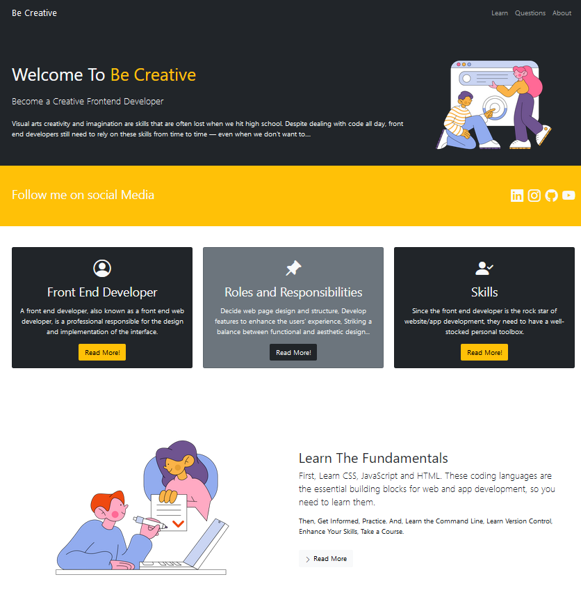

# Be Creative - Become a Creative Front-End Developer

This project is designed to guide and inspire aspiring front-end developers. It provides educational content in a modal-based interactive format to help users learn about the role of a front-end developer, stay creative, understand web design disciplines, and learn the fundamentals of becoming a front-end developer.

## Project Overview

The "Be Creative" website focuses on introducing essential concepts of front-end development, along with creative tips and techniques. It includes
  - Introduction to the role of a front-end developer
  - Creative tips for building engaging websites
  - The key disciplines involved in web design
  - Step-by-step guidance on how to start learning front-end development

## Features

- Interactive Modals:
  - Roles of a Front-End Developer: Explains the primary duties and responsibilities of a front-end developer.
  - Stay Creative: Provides insights on how front-end developers can stay creative and enhance the visual appeal of their websites.
  - Web Design Disciplines: Discusses the various design disciplines essential to building great websites, such as typography, layout, and user experience.
  - Learn the Fundamentals: A practical guide on how to become a front-end developer, focusing on HTML, CSS, JavaScript, and other key concepts.
- Responsive Design: The layout is fully responsive, built using Bootstrap, making it accessible and user-friendly on various screen sizes, from mobile to desktop.

## How to Use

1. Open the HTML File: Simply open the index.html file in any web browser to view the site.

2. Navigate Through the Modals:

  - Click on the buttons in the main content section to open the modals and explore various educational topics.
  - Each button corresponds to a different aspect of front-end development.

3. Learn and Practice: Use the educational material within the modals to guide your learning journey as a front-end developer.

## Requirements

- A modern web browser (Chrome, Firefox, Safari, etc.) to view the website.
- Bootstrap 5: This project uses Bootstrap for layout and modal functionality. Bootstrap is included via a CDN link in the HTML file.

## Getting Started

To get started with this project:

1. Clone or download the repository.
2. Open the index.html file in your browser to access the content.
3. Modify or extend the project by adding additional modals, content, or customization as per your needs.

## Customization

You can easily customize this project:

- Change Content: Update the text within the modals to reflect your own educational material or front-end development advice.
- Modify Design: Adjust the layout, colors, and typography by modifying the styles.css file (if used).
- Add New Modals: If you'd like to add more topics or features, just add new buttons and corresponding modal content.

## Technologies Used

- HTML5: Markup structure of the website.
- CSS3: Basic styling and layout.
- JavaScript: Powered by Bootstrap's built-in JavaScript for modal functionality.
- Bootstrap 5: For layout and responsiveness.

## Contributing

If you would like to contribute to this project, feel free to fork the repository, make changes, and submit a pull request.
